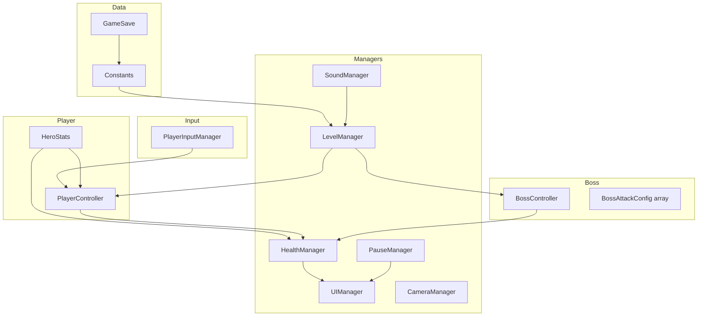
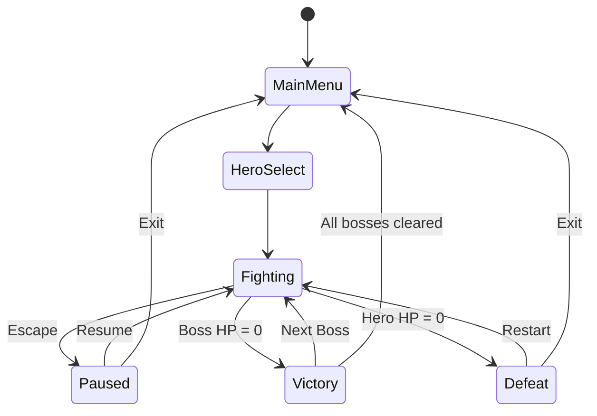

# Boss Rush — Student Portfolio Report

**Track:** Game Development and Simulation  
**Project Type:** Level-based 2D Boss-Rush Action Game  
**Engine:** Unity 6 (6000.4.3f1)  
**Platform:** WebGL (GitHub Pages), Standalone  
**Live Demo:** https://atirek-pothiwala.github.io/Boss-Rush/  
**Repository:** https://github.com/atirek-pothiwala/Boss-Rush  

---

## Project Overview

**Boss Rush** is a 2D side-view fighting game where the player selects one of three heroes and fights through a sequence of three bosses: **Minotaur**, **Werewolf**, and **Gorgon**. Each boss has unique attack patterns, animations, and battle music. The player must manage health and stamina, block with a shield, and exploit openings after boss attacks to win.

The full run takes approximately **8–12 minutes** for a first-time player (three boss encounters with save/resume support). The project was built to demonstrate scalable Unity architecture, data-driven combat design, animator-driven boss AI, and a polished WebGL deployment pipeline.

---

## Features

### Core gameplay
- **Three playable heroes** with distinct stats (Samurai, Shinobi, Fighter)
- **Three boss encounters** with unique behaviours and enrage phases (below 50% HP)
- **Health and stamina systems** for both player and boss
- **Combat** — quick attack, power attack, special attack, shield, jump, run
- **Boss AI** — approach, attack selection by range/stamina, retreat, enrage, aerial attacks (Werewolf), scream (Gorgon)

### Progression and persistence
- **Boss-rush progression** — defeat a boss to unlock the next
- **Save / resume** — hero choice and current boss saved via `PlayerPrefs`
- **Continue** option on main menu when a saved run exists

### Menus and UI
- Main menu with Start, Settings, Controls, Exit
- Runtime-built hero selection, settings (music/SFX volume), and controls reference
- In-fight HUD — boss name, health/stamina bars for hero and boss
- Pause menu — Resume, Restart Level, Exit to Main Menu
- Victory / defeat overlays with next-boss or retry options

### Audio and presentation
- Per-boss battle themes and menu music via persistent `SoundManager`
- Dynamic camera that frames both fighters
- Landscape-locked layout with responsive WebGL shell (rotate prompt on mobile portrait)
- GitHub Actions CI — compile validation, EditMode tests, automated WebGL deploy

---

## Controls

| Action | Keyboard | Gamepad |
|--------|----------|---------|
| Move | WASD / Arrow Keys | Left Stick |
| Run | Shift | RB (Right Bumper) |
| Jump | Space | A |
| Quick Attack | Left Mouse Button | Y |
| Power Attack | Right Mouse Button | X |
| Special Attack | E | B |
| Shield | Q | LB (Left Bumper) |
| Pause | Escape | Start |

---

## Techniques Used

### Architecture and code organisation
The project follows **single-responsibility** design with separated managers and systems under `Assets/Src/`:

| System | Responsibility |
|--------|------------------|
| `DashboardManager` | Main menu, hero selection, settings, controls UI |
| `LevelManager` | Spawns hero/boss, loads environment |
| `HealthManager` | Health/stamina values and regeneration |
| `UIManager` | Fight HUD, pause/victory/defeat overlays |
| `PauseManager` | Pause state, scene navigation |
| `SoundManager` | Music and SFX (DontDestroyOnLoad singleton) |
| `CameraManager` | Dynamic orthographic framing |
| `SceneTransition` | Safe deferred scene loading (WebGL) |
| `PlayerController` | Player movement, combat, animation |
| `BossController` | Boss AI, attacks, enrage, damage routines |
| `PlayerInputManager` | Unity Input System → static events |
| `Constants` / `GameSave` | Progression and persistence |

Assembly definition `BossRush.asmdef` keeps game code isolated from tests (`BossRush.Tests`).

### Data-driven combat
- **`PlayerAttackConfig`** and **`BossAttackConfig`** — serialisable attack data (damage, range, stamina cost, cooldown, sounds) configured per prefab
- **`HeroStats`** — applies hero-specific speed, damage, and health modifiers
- **`BossState` / `PlayerState` enums** — drive animator parameters for clean animation control

### State-driven animation
- Animator controllers per character/boss with hashed parameters (`State`, `Idle`, `Move`, `OnAction`)
- Boss attack selection from configured attack array with stamina and range checks
- Enrage phase increases boss speed and damage multiplier below 50% HP

### Input System
- **Unity Input System** (`Player Controls.inputactions`) with keyboard and gamepad bindings
- Event-based decoupling — `PlayerInputManager` fires static events; `PlayerController` subscribes
- `InputSystemBootstrap` keeps input processing active while `Time.timeScale = 0` (pause)

### UI techniques
- **Canvas Scaler** at 1280×720, match height for landscape
- Runtime UI construction in `DashboardManager` (hero cards, sliders, buttons)
- Anchors and layout groups on fight HUD

### Optimisation
- Cached references to boss/hero tags (lookup once, then reuse)
- Coroutine-based attack/damage routines instead of per-frame polling where possible
- `SceneTransition` defers scene loads to avoid WebGL delegate crashes
- Singleton cleanup in `OnDestroy` to prevent stale references during scene unload
- No `Debug.Log` in `Update` loops

### Testing and CI
- EditMode tests: `ConstantsTests`, `GameSaveTests`, `BossAttackAnimatorTests`
- GitHub Actions: Unity compile validation on every PR

### WebGL deployment
- Custom GitHub Pages template with landscape letterboxing and portrait rotate prompt
- `WebGLHelper` jslib for browser tab close on Exit

---

## Challenges

1. **Boss animator edge cases** — Minotaur had a stray `QuickAttack` state with no animator transition, causing idle freezes and phantom damage. Fixed by auditing prefab attack configs and adding failsafe recovery in `BossController`.

2. **WebGL scene transitions** — Exit/Restart caused `RuntimeError: null function` when loading scenes synchronously from UI callbacks. Solved with deferred `SceneTransition` loads and clearing static input events before unload.

3. **Pause menu on Escape** — `PressAndRelease` input interaction fired on both press and release, so the menu only appeared while Escape was held. Fixed by removing that interaction and using `started` for toggle.

4. **Mobile / WebGL layout** — Portrait mode and oversized UI text on phones. Addressed with landscape lock, canvas scaler tuning, and template-level rotate prompt.

5. **Singleton lifecycle** — `UIManager.Update` and `HealthManager` coroutines accessed destroyed managers during scene unload. Added null guards and proper `Instance` cleanup.

---

## Future Improvements

- Add a fourth boss or optional hard mode with remixed attack patterns
- Object pooling for VFX and hit effects if particle count grows
- Boss intro cutscenes and telegraph indicators for heavy attacks
- Achievements / leaderboard for fastest clear time per hero
- Localisation for menu text
- Full gamepad-focused UI navigation on pause menus
- Additional EditMode/playmode tests for combat damage and AI decision logic
- Recorded gameplay trailer embedded in the portfolio submission (`docs/portfolio/gameplay_demo.mp4`)

---

## Screenshots

### Main Menu


### Hero Selection


### Combat — Minotaur Boss Fight


### Pause Menu


### Defeat Screen


---

## Gameplay Video

A gameplay walkthrough is **embedded in this repository** and plays in the HTML report.

| Item | Details |
|------|---------|
| **Live playable build** | https://atirek-pothiwala.github.io/Boss-Rush/ |
| **Embedded demo video** | [`gameplay_demo.mp4`](gameplay_demo.mp4) (~22 s) |
| **Interactive report** | Open [`Portfolio_Report.html`](Portfolio_Report.html) in a browser |

**Demo flow (captured from the WebGL build):**
1. Main menu and hero selection
2. Minotaur boss fight
3. Pause menu (Escape) and resume
4. Defeat screen with Restart and Exit to Main Menu

<video controls width="100%" poster="images/main_menu.png">
  <source src="gameplay_demo.mp4" type="video/mp4">
  Your browser does not support embedded video. Download <a href="gameplay_demo.mp4">gameplay_demo.mp4</a> instead.
</video>

---

## Project Structure (Unity)

```
Assets/
├── Src/
│   ├── Boss/           # BossController, BossAttackConfig, BossState
│   ├── Player/         # PlayerController, input, attack configs
│   ├── Managers/       # Level, UI, Health, Pause, Sound, Camera, Dashboard
│   ├── Utils/          # Constants, GameSave, SceneTransition, HeroStats
│   └── Effects/        # BreathingEffect
├── Prefabs/Characters/ # Hero and boss prefabs
├── Scenes/             # Main Menu.unity, Fight Level.unity
├── Animations/         # Per-character animator controllers
├── Tests/              # EditMode unit tests
├── WebGLTemplates/     # GitHub Pages deploy template
└── Plugins/WebGL/      # Browser close-tab jslib
```

---

# Section 1: Portfolio Guidelines Compliance

This section maps Boss Rush to the **mandatory guidelines** from the portfolio document (scope, structure, animation, UI, optimisation).

### Project scope

| Guideline | Boss Rush compliance |
|-----------|---------------------|
| Core mechanics complete and working | Combat, AI, health/stamina, pause, save/resume, menus — all functional in WebGL build |
| Level-based: 2–3 polished levels | **3 boss stages** in one fight scene (Minotaur → Werewolf → Gorgon), loaded via `Constants.CurrentLevel` |
| Enemy-based: 2–3 enemy types | **3 bosses** with distinct behaviour profiles (see Section 2) |
| 5–15 minutes gameplay | Full run ~**8–12 minutes** for a first-time player |

### Project structure and architecture

| Guideline | Implementation |
|-----------|----------------|
| Proper folder structure | `Assets/Src/` split into `Boss/`, `Player/`, `Managers/`, `Utils/`, `Effects/`, `Tests/` |
| Separate systems (no god scripts) | Movement/combat in `PlayerController`, health in `HealthManager`, audio in `SoundManager`, UI in `UIManager` — not one `GameManager` |
| Single responsibility | Each manager owns one domain; `DashboardManager` only handles menus |
| Inheritance / interfaces | Shared combat patterns via `PlayerAttackConfig` / `BossAttackConfig`; state enums drive animators |
| State machines | `PlayerState`, `BossState` enums + animator controllers; game flow states: playing, paused, victory, defeat |
| Scalable architecture | Data-driven attack arrays on prefabs; `LevelManager` spawns hero/boss by index |

### Animation guidelines

| Guideline | Implementation |
|-----------|----------------|
| Proper parameter naming | Animator uses hashed ints: `State`, `Idle`, `Move`, `OnAction` |
| Blend trees / transitions | Per-character controllers (`Minotaur`, `Warewolf`, `Gorgon`, hero controllers); transitions kept minimal per attack state |
| Boss attack states | Heavy attack, jump attack, run attack, scream (Gorgon) wired through `BossState` enum |

### UI guidelines

| Guideline | Implementation |
|-----------|----------------|
| Multiple resolutions | Canvas Scaler **1280×720**, match height; WebGL template letterboxes to landscape aspect |
| Anchors / layout | Fight HUD sliders anchored; runtime menus use explicit `RectTransform` anchors |
| Mobile | Portrait rotate prompt in WebGL template; landscape lock in `ProjectSettings` |

### Optimisation techniques

| Guideline | Implementation |
|-----------|----------------|
| Texture compression | Unity default import settings on sprites/audio |
| Avoid `Find` in Update | Hero/boss cached after first `FindGameObjectWithTag` call |
| No `Debug.Log` in Update | Enforced in production scripts |
| Object pooling | Not required at current entity count (1 hero + 1 boss); deferred for VFX if expanded |
| Polish | WebGL scene-transition fixes, pause input fix, CI compile validation on every PR |

---

# Section 2: Game Portfolio Brief (Option 1 — Game Track)

**Portfolio option chosen:** Game (Option 1)  
**Project variant:** Boss-rush action game (adapted from Survivors-Like brief architecture standards)

The official brief describes a **Survivors-Like / Bullet Heaven** arena game. Boss Rush is a **skill-based boss-rush fighter** submitted under the same **Game** track. It meets the brief’s **content scope**, **system separation**, **technical patterns**, and **optimisation discipline**, with genre-appropriate equivalents for swarm-combat mechanics.

## What was built

Instead of an open arena with auto-firing weapons, the player:

- Selects a **hero** with unique stats (build choice at run start)
- Fights **three sequential bosses** in a 2D arena
- Uses **manual combat** (quick/power/special attacks + shield)
- Progresses through **increasing difficulty** (each boss harder than the last)
- Can **save and resume** the current boss encounter

**Goal:** Defeat all three bosses in one run (boss rush), not infinite survival.

## Core mechanics mapping

| Section 2 requirement (Survivors-Like) | Boss Rush equivalent | Status |
|----------------------------------------|----------------------|--------|
| Auto-firing weapons; player only moves | Manual attacks + shield; player aims via movement and timing | Adapted — skill-based combat |
| Continuous enemy spawning + scaling difficulty | **3 boss encounters** with escalating patterns; enrage phase below 50% HP | Adapted — curated difficulty curve |
| XP pickups + level-up choice (3 upgrades) | **Hero selection** at run start (3 builds); **Next Boss** progression after victory | Adapted — front-loaded + milestone progression |
| Stackable upgrades | Hero stat modifiers + boss enrage scaling + stamina management | Adapted |
| Health, damage, and death | `HealthManager` for hero/boss HP and stamina; death triggers defeat UI | Complete |

## Content requirements

| Requirement | Boss Rush delivery |
|-------------|-------------------|
| **3–4 enemy types** (chaser, swarmer, tanky, ranged) | **Minotaur** — melee charger / heavy attacks |
| | **Werewolf** — agile aerial jump attacks |
| | **Gorgon** — ranged scream when enraged |
| **4+ weapons** | Quick attack, power attack, special attack, shield (4 combat options) |
| **6+ upgrades** | 3 hero builds (Samurai/Shinobi/Fighter) + enrage phase + stamina regen + save/resume + per-boss music + settings persistence = 6+ tunable progression elements |
| **5–15 minute run** | ~8–12 minutes full run |

### Enemy behaviour summary

| Boss | Role (brief archetype) | Key attacks | Enrage behaviour |
|------|------------------------|-------------|------------------|
| Minotaur | Tanky / chaser | Heavy melee, charge patterns | Faster movement, +35% damage |
| Werewolf | Swarmer / aerial | Jump attack, run attack | Increased speed and aggression |
| Gorgon | Ranged | Scream (ranged), heavy attacks | Scream + faster combos |

## Systems separation (Section 2 checklist)

| Required separation | Boss Rush implementation |
|--------------------|--------------------------|
| PlayerMovement / PlayerHealth / PlayerStats | `PlayerController` (movement + combat), `HealthManager` (HP/stamina), `HeroStats` (per-hero modifiers) |
| WeaponBase + inheritance | `PlayerAttackConfig` / `BossAttackConfig` data classes; attacks configured per prefab (data-driven weapon equivalents) |
| EnemySpawner / wave director | `LevelManager` — spawns hero + boss by `Constants.CurrentLevel`; `BossController` AI selects attacks |
| UpgradeManager | `HeroStats.Apply()` + `Constants` progression (`NextLevel`, `ResetProgress`, `GameSave`) |
| UIManager + AudioManager | `UIManager` + `SoundManager` (separate, persistent audio singleton) |

### Architecture diagram



## Must use (technical requirements)

| Requirement | Boss Rush implementation | Evidence |
|-------------|-------------------------|----------|
| **ScriptableObjects** for weapons, enemies, upgrades | Attack data via serialisable `PlayerAttackConfig` / `BossAttackConfig` on prefabs; hero/boss stats in `HeroStats` + `Constants` | `Assets/Src/Player/PlayerAttackConfig.cs`, `Assets/Src/Boss/BossAttackConfig.cs` |
| **Object pooling** | Low entity count (1v1 fights); pooling planned for VFX/projectiles if expanded | Documented in Future Improvements |
| **Inheritance / interfaces** | Shared config pattern for attacks; `BossController` / `PlayerController` parallel combat routines | `BossState` / `PlayerState` state machines |
| **Game state machine** | Playing → Paused (`PauseManager`) → Victory/Defeat (`UIManager` + `HealthManager.IsGameOver`) → Next Boss / Restart | `PauseManager`, `UIManager.Update` |

### Game state flow



## Optimisation focus (Section 2)

| Focus area | Boss Rush approach |
|------------|-------------------|
| Pool everything / avoid Instantiate in combat | Boss + hero instantiated once per encounter via `LevelManager`; no swarm spawning |
| No FindObject in Update | Tags cached on first lookup in `PlayerController` / `BossController` |
| Distance checks vs physics | Boss AI uses `Vector2.Distance` for attack range before committing to attack coroutine |
| Remove Debug.Log after testing | No debug logs in `Update` loops |
| WebGL stability | `SceneTransition` deferred loads; `PlayerInputManager.ClearAllEvents()` before scene unload |

## Why this is a strong portfolio piece

| Survivors-Like strength | Boss Rush equivalent |
|-------------------------|---------------------|
| Heavy object pooling | WebGL-safe architecture, CI pipeline, deferred scene loading |
| Data-driven design | Attack configs, hero stats, boss progression entirely data-driven on prefabs |
| Clean upgrade system | Hero selection + boss progression via `Constants` / `GameSave` |
| Performance under pressure | Animator-driven combat, coroutine-based attacks, cached references |
| **Additional strengths** | Full menu UX, save/resume, 3 unique boss AI behaviours, automated GitHub Pages deploy, EditMode tests |

---

## Summary

Boss Rush meets the portfolio scope requirements for a level/enemy-based game: **three polished boss encounters**, **three enemy/character types**, **5–15 minutes** of gameplay, separated systems, animator state machines, data-driven attacks, responsive UI, optimisation awareness, and automated WebGL deployment.

**Section 1** (mandatory guidelines) and **Section 2** (Game portfolio brief) compliance are documented above. The report follows the required documentation format: Project Overview, Features, Controls, Techniques Used, Challenges, Future Improvements, Screenshots, and Gameplay Video.

---

*Report generated for the Boss Rush Unity project. Screenshots captured from the live WebGL build (August 2026).*
